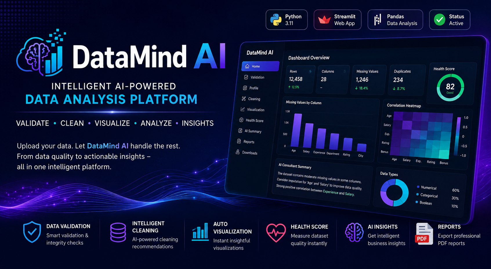
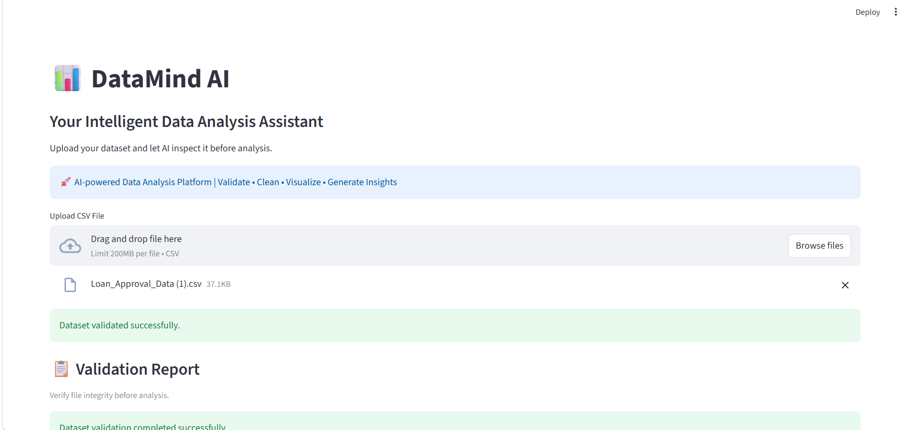
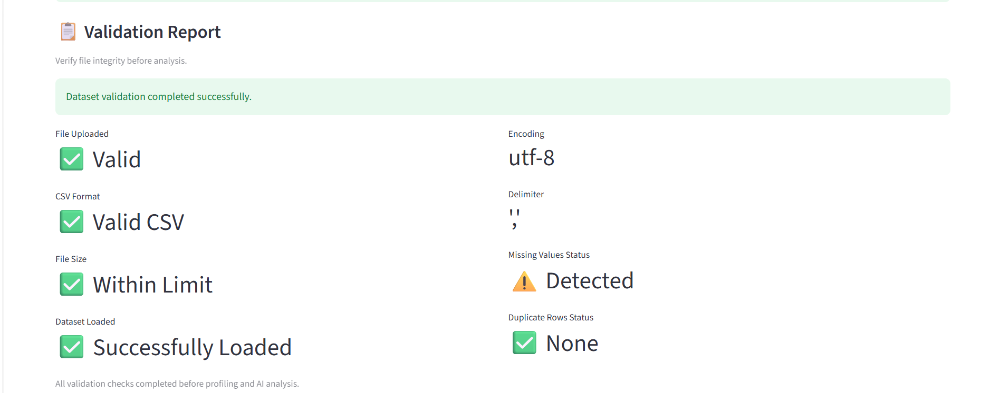
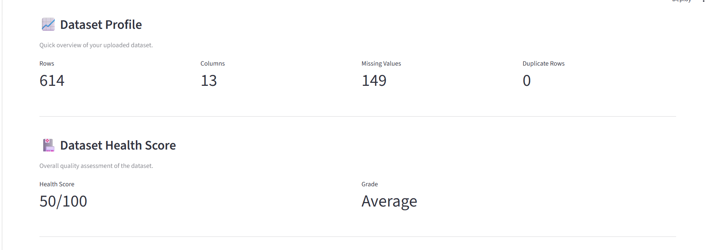
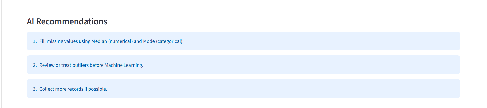
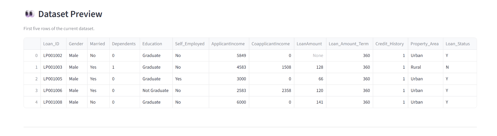
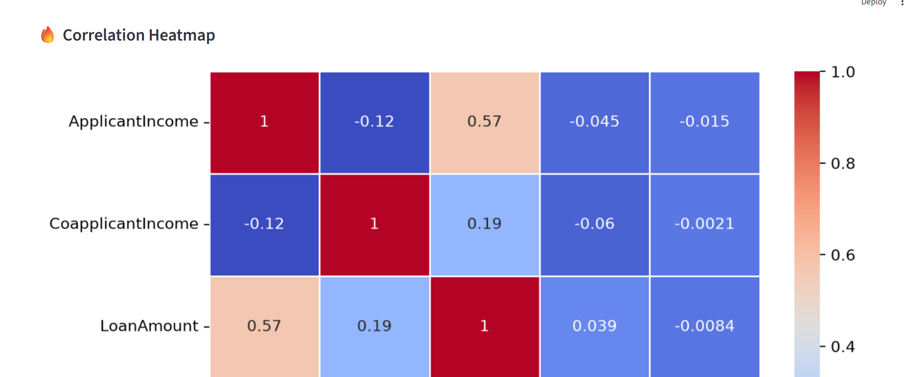

<p align="center">
  
</p>

# 📊 DataMind AI

<p align="center">

**🚀 Intelligent AI-Powered Data Analysis Platform**

Validate • Clean • Visualize • Analyze • Generate AI Insights

</p>

<p align="center">


</p>

---

# 📌 Overview

**DataMind AI** is an end-to-end AI-powered Data Analysis platform developed using **Python** and **Streamlit**.

Instead of manually checking datasets, cleaning missing values, detecting duplicates, creating visualizations, and generating reports, DataMind AI performs these tasks through an interactive dashboard.

The goal of this project is to reduce repetitive data analysis work while helping beginners, students, analysts, and machine learning practitioners understand their datasets quickly.

---

# ⭐ Why DataMind AI?

Most beginner data analysis projects stop after plotting a few charts.

**DataMind AI goes much further by providing:**

* ✅ Intelligent Dataset Validation
* ✅ Automated Data Cleaning
* ✅ AI Cleaning Recommendations
* ✅ Interactive Visualizations
* ✅ Dataset Health Score
* ✅ AI Consultant Summary
* ✅ PDF Report Generation
* ✅ Clean Dataset Download
* ✅ Modular Service-Based Architecture
* ✅ Beginner-Friendly User Interface

---

# ✨ Key Features

## 📁 Dataset Validation

* CSV Validation
* Encoding Detection
* Delimiter Detection
* File Size Validation
* Dataset Integrity Check

---

## 📊 Dataset Profiling

* Total Rows
* Total Columns
* Missing Values
* Duplicate Rows
* Memory Usage
* Numerical Columns
* Categorical Columns
* Potential Identifier Columns

---

## 🧹 Intelligent Data Cleaning

* Missing Value Detection
* AI Cleaning Suggestions
* Mean Imputation
* Median Imputation
* Mode Imputation
* Forward Fill
* Backward Fill
* Drop Rows
* Drop Columns
* Duplicate Removal

---

## 📈 Automated Data Visualization

* Histogram
* Bar Chart
* Box Plot
* Correlation Heatmap

---

## ❤️ Dataset Health Score

Automatically evaluates dataset quality based on:

* Missing Values
* Duplicate Records
* Outlier Impact
* Overall Dataset Completeness

---

## 🧠 AI Consultant Summary

Generates intelligent business insights including:

* Critical Missing Value Alerts
* Identifier Detection
* Correlation Insights
* Data Quality Warnings
* Business Recommendations

---

## 📄 Export Features

* Download Clean Dataset (.CSV)
* Generate PDF Analysis Report

---

# 📸 Application Preview

## 🏠 Home Dashboard



---

## ✅ Validation Report



---

## 📈 Dataset Profile



---

## 🧹 Cleaning Recommendations



---

## 👀 Dataset Preview



---

## 📊 Visualization Dashboard



---

# 🛠️ Technology Stack

| Category          | Technologies       |
| ----------------- | ------------------ |
| Language          | Python             |
| Framework         | Streamlit          |
| Data Processing   | Pandas, NumPy      |
| Visualization     | Matplotlib         |
| Report Generation | FPDF               |
| Version Control   | Git & GitHub       |
| IDE               | Visual Studio Code |

---

# 📌 Highlights

✔ Modular Service-Based Architecture

✔ Interactive Streamlit Dashboard

✔ AI-Inspired Data Cleaning Suggestions

✔ Professional PDF Report Generation

✔ Automated Dataset Quality Assessment

✔ Production-Ready Folder Structure

---

# 🏗️ Project Architecture

<p align="center">
  
</p>

## Workflow

1. User uploads a CSV dataset.
2. Validation Service verifies file integrity.
3. Profiling Service analyzes the dataset.
4. Cleaning Services handle missing values, duplicates, and outliers.
5. Visualization Service generates charts.
6. Dataset Health Score evaluates data quality.
7. AI Consultant generates insights.
8. PDF Report and Clean Dataset are available for download.
---

# 📂 Project Structure

```text
DataMind-AI/
│
├── app/
│   ├── main.py
│   │
│   ├── services/
│   │   ├── validation_service.py
│   │   ├── profile_service.py
│   │   ├── cleaning_service.py
│   │   ├── missing_value_service.py
│   │   ├── duplicate_service.py
│   │   ├── outlier_service.py
│   │   ├── visualization_service.py
│   │   ├── health_score_service.py
│   │   ├── consultant_service.py
│   │   ├── pdf_report_service.py
│   │   └── download_service.py
│
├── assets/
│   └── screenshots/
│
├── README.md
├── requirements.txt
├── LICENSE
└── .gitignore
```

---

# ⚙️ Installation

Clone the repository:

```bash
git clone https://github.com/anchitprojectsml/Datamind-AI.git
```

Move into the project directory:

```bash
cd Datamind-AI
```

Install the required dependencies:

```bash
pip install -r requirements.txt
```

Run the application:

```bash
streamlit run app/main.py
```

---

# 🚀 How to Use

### Step 1

Upload any CSV dataset.

---

### Step 2

The application automatically validates:

* CSV format
* Encoding
* Delimiter
* File size
* Dataset integrity

---

### Step 3

Review the generated dataset profile.

---

### Step 4

Inspect AI-powered cleaning recommendations.

---

### Step 5

Apply cleaning methods interactively.

---

### Step 6

Generate visualizations.

Available charts include:

* Histogram
* Bar Chart
* Box Plot
* Correlation Heatmap

---

### Step 7

Review Dataset Health Score.

---

### Step 8

Read AI Consultant Summary.

---

### Step 9

Download:

* Clean Dataset (.csv)
* PDF Analysis Report

---

# ⚡ Core Services

## Validation Service

Performs intelligent validation before analysis.

Responsibilities:

* Encoding detection
* Delimiter detection
* CSV validation
* Dataset loading

---

## Profile Service

Generates a quick overview of the uploaded dataset.

Includes:

* Rows
* Columns
* Missing values
* Duplicate rows
* Memory usage

---

## Cleaning Service

Analyzes the dataset and recommends the most suitable cleaning strategy for each column.

---

## Missing Value Service

Supports:

* Mean
* Median
* Mode
* Forward Fill
* Backward Fill
* Drop Rows
* Drop Columns

---

## Duplicate Service

Identifies duplicate records and removes them while preserving data integrity.

---

## Outlier Service

Detects statistical outliers using the Interquartile Range (IQR) method.

---

## Visualization Service

Automatically generates insightful visualizations for numerical and categorical data.

---

## Dataset Health Score Service

Calculates an overall quality score for the dataset based on multiple quality indicators.

---

## AI Consultant Service

Generates human-readable insights and recommendations to help users better understand their datasets.

---

## PDF Report Service

Creates a professional analysis report summarizing the dataset, health score, and AI recommendations.

---

# 📈 Current Capabilities

Current Version (v1.0.0) supports:

* Dataset Validation
* Dataset Profiling
* Missing Value Handling
* Duplicate Handling
* Outlier Detection
* Automated Visualization
* Correlation Analysis
* Dataset Health Score
* AI Consultant Summary
* PDF Report Generation
* Clean Dataset Download

---

# 🗺️ Roadmap

## ✅ Version 1.0.0 (Current Release)

* Dataset Validation
* Dataset Profiling
* Missing Value Handling
* Duplicate Handling
* Outlier Detection (IQR)
* Automated Data Visualization
* Correlation Heatmap
* Dataset Health Score
* AI Consultant Summary
* PDF Report Generation
* Clean Dataset Download
* Interactive Streamlit Dashboard

---

## 🚀 Version 2.0 (In Progress)

The next major release will transform DataMind AI into an intelligent Machine Learning platform.

### Planned Features

* AI ML Task Detection
* Automatic Target Column Detection
* Feature Engineering Suggestions
* Regression Pipeline
* Classification Pipeline
* Clustering Pipeline
* Model Evaluation
* Performance Metrics
* Prediction Interface
* Model Export

---

## 🌟 Version 3.0 (Future Vision)

* Explainable AI (XAI)
* Natural Language Dataset Chat
* LLM-based Data Insights
* Dashboard Builder
* Time Series Analysis
* Deep Learning Support
* Multi-file Projects
* SQL Database Integration
* Cloud Storage Support

---

# 💡 Why This Project?

DataMind AI was created to simplify the data analysis workflow.

Instead of writing repetitive code for every dataset, users can upload a CSV file and receive:

* Dataset validation
* Automated cleaning recommendations
* Interactive visualizations
* Quality assessment
* AI-generated insights
* Professional reports

The long-term vision is to evolve DataMind AI into a complete AI-assisted data science platform.

---

# 🤝 Contributing

Contributions are welcome!

If you'd like to improve DataMind AI:

1. Fork the repository.
2. Create a new feature branch.
3. Commit your changes.
4. Push your branch.
5. Open a Pull Request.

Bug reports, feature requests, and suggestions are always appreciated.

---

# 📜 License

This project is released under the **MIT License**.

You are free to use, modify, and distribute this project in accordance with the license terms.

---

# 👨‍💻 Author

**Anchit**

AI & Data Science Enthusiast

Developer of **DataMind AI**

GitHub:

https://github.com/anchitprojectsml

---

# ⭐ Support the Project

If you found this project useful:

* ⭐ Star this repository
* 🍴 Fork the repository
* 🐛 Report issues
* 💡 Suggest new features
* 📢 Share it with others

Your support helps improve the project and motivates future development.

---

# 📊 Project Status

| Component            | Status            |
| -------------------- | ----------------- |
| Validation Engine    | ✅ Complete        |
| Dataset Profiling    | ✅ Complete        |
| Data Cleaning        | ✅ Complete        |
| Duplicate Handling   | ✅ Complete        |
| Outlier Detection    | ✅ Complete        |
| Visualization Engine | ✅ Complete        |
| Correlation Analysis | ✅ Complete        |
| Dataset Health Score | ✅ Complete        |
| AI Consultant        | ✅ Complete        |
| PDF Report           | ✅ Complete        |
| Dataset Download     | ✅ Complete        |
| Streamlit UI         | ✅ Complete        |
| Version 1            | ✅ Released        |
| Version 2            | 🚧 In Development |

---

# 🙏 Acknowledgements

Special thanks to the open-source community and the Python ecosystem, including:

* Python
* Streamlit
* Pandas
* NumPy
* Matplotlib
* FPDF
* Git & GitHub

These tools made the development of DataMind AI possible.

---

<p align="center">

**⭐ If you like this project, don't forget to star the repository! ⭐**

Made with ❤️ using Python & Streamlit.

</p>

